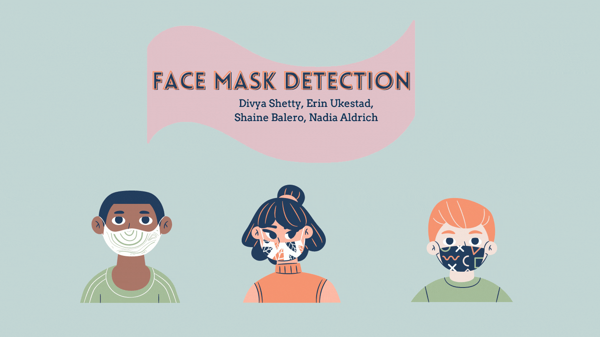

# Inspiration:
<b/>

In San Antonio, the coronavirus pandemic officially began on March 2020 and by April 2020, the CDC began recommending face mask to help slow the spread of the virus. 
 Since then, we have all, at one point or another, been subject to wearing a face mask.  

<b/>

## [***Click here for a full timeline.***](https://www.texastribune.org/2020/07/31/coronavirus-timeline-texas/https://www.texastribune.org/2020/07/31/coronavirus-timeline-texas/)

---
# Objective: 

 Create a face mask detecting system....pending official methods and jargon 

</b>

# Why use Face Mask Detector?
- still mandatory for visitors and workers for  to wear masks in Healthcare Facilities
- how are facilties checking public and private access points 
- how  is  census being taken for city and state regulations health regulations
# Solution 
- face mask checks
- app acts as partial system clearance 
- maintains constant checks for building census
- establish accurate predictions of mask use in state inspections
- Hospitals & healthcare could use its application to better enforce mask use
# How Mask Detection Works
